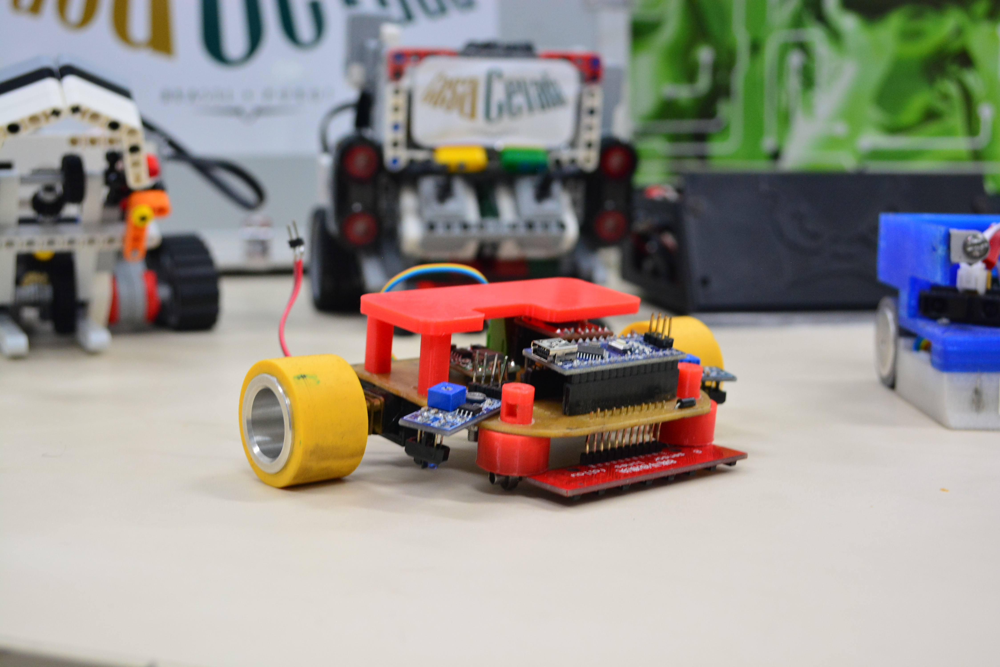

# Carrinho seguidor de linha : Mercurio

O carrinho seguidor de linha foi desenvolvido para participar das competições de robótica que o grupo GERSE vai participar dentre elas Winter Challenge e TRIF.

O mesmo vem de uma serie de  aprimoramentos  dês de 2017 , e acumulou os seguintes prêmios

- Winter Challenge , 2018 onde fomos 32º lugar de 80 participantes;
- TRIF , 2018 onde fomos 2º  lugar

## Primeira versão

## Segunda versão

- Winter Challenge , 2018 onde fomos 24º lugar de 73 participantes;

